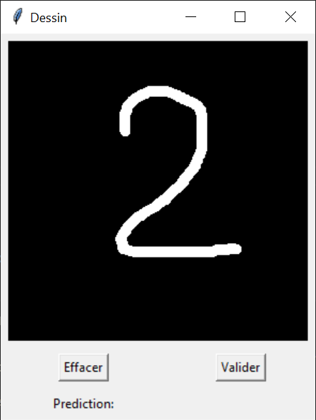

# Classification des chiffres manuscrites


Projet réalisé avec Romain et Morgan.

## Table des matières
1. [Organisation du répertoire](#OR)
2. [Principe du CNN](#CNN)
    1. [Partie 1 : Réseau de neurones](#RN)
    2. [Partie 2 : Convolution Neural Network (CNN)](#CNN2)
3. [Context Pédagogique](#ContextPedagogique)
    1. [Partie 1 : Base de données, Analyse et Préparation](#P1)
    2. [Partie 2 : Architecture CNN sur Tensorflow](#P2)
    3. [Partie 3 : Tester l’efficacité du modèle](#P3)
4. [Original repository](#origin)

## Organisation du répertoire <a id="OR"></a>
```
.
├───app_digit.py
├───fabio.ipynb
├───README.md
├───Dataset
│   ├───testing
│   │   ├───0
│   │   ├───1
│   │   ├───2
│   │   ├───3
│   │   ├───4
│   │   ├───5
│   │   ├───6
│   │   ├───7
│   │   ├───8
│   │   └───9
│   └───training
│       ├───0
│       ├───1
│       ├───2
│       ├───3
│       ├───4
│       ├───5
│       ├───6
│       ├───7
│       ├───8
│       └───9
├───model_CNN
├───rsc
│   └───app.png
└───test_manuscrit
```

### Application reconnaissance manuscrite

L'application **app_digit.py**, est une application développer avec tkinter qui met en oeuvre un canva sur lequel on peut dessiner avec la souris. Deux boutons sont présents, le premier (*effacer*), permet de reinitialiser le canva pour rattraper un dessin raté. Le second (*valider*), permet de valider le dessin et de réaliser une prédiction qui apparaitra en bas de l'interface.



## Principe du CNN <a id="CNN"></a>

### Partie 1 : Réseau de neurones <a id="RN"></a>

Les réseaux de neurones sont des architectures de machine à états finis. Ils sont composés de couches également appelé *layers*, et chaque couche est composée de plusieurs neurones. Chaque couche est composée de neurones de même type, mais il peut y avoir des couches de neurones différents. Un neurone se présente de la manière suivante :


Un neurone reçoit des données en entrée, que l'on appelle *inputs* et que l'on multiplie par un poids. Ces données sont ensuite traitées par des fonctions de transfert, dites également fonction *d'activation*. Produisant ainsi une nouvelle valeur de sortie. La sortie est ensuite reliée à chaque neuronne de la couche suivante, ainsi de suite jusqu'à la couche de sortie. Tout cet enchaînement représente ce que l'on appelle un un *réseau de neurones*.

En terme d'architecture on retrouve les couches suivantes :
- la couche d'entrée : c'est la première couche du réseau de neurones. Elle contient les neurones qui reçoivent les données en entrée.
- les couches cachées (*hidden layers*): ce sont les couches intermédiaires du réseau de neurones. Elles permettent la liaison entre les neurones de la couche d'entrée et les neurones de la couche de sortie.
- La couche de sortie : c'est la dernière couche du réseau de neurones. Elle contient les neurones qui produisent les valeurs de sortie.

### Partie 2 : Convolution Neural Network (CNN) <a id="CNN"></a>

Les réseaux de neuronnes convolutifs sont des réseaux de neurones qui utilisent des filtres de convolution pour extraire des informations dans les images. Ce qui permet ainsi de faire des prédictions plus précises sur les images, et donc de réaliser de la classification. La compposition d'un CNN est faite de plusieurs étapes (couches):

- **Les étapes de convolution :** les filtres de convolution permettent de réaliser des prédictions sur les images. Ces filtres sont des matrices de convolution qui sont appliquées à chaque image, à l'aide d'un noyau egalement appelé *kernel*. Le noyau est ensuite déplacer dans l'image, avec un certain pas (*stride*), pour calculer les valeurs de convolution.
- **Les étapes de pooling :** cette étape intervient après l'application d'une couche de convolution. Les filtres de pooling ont pour objectif de réduire la taille des images, en ne gardant que les valeurs les plus importantes. Cela permet d'économiser de la mémoire, et d'éviter de calculer des valeurs inutiles. Ces filtres sont également appliqué à l'aide d'un noyau également appelés *pooling kernels*. Les méthodes habituellement utilisées sont le *maxium pooling* et le *average pooling*.
Les étapes de convolution et de pooling permettent ainsi d'extraire des informations dans les images, ces informations sont ensuite utilisées pour faire des prédictions sur les images, en les introduisant dans un réseau de neurones, que l'on appelle ici *couche denses*.
- **L'étape *Fully connected*:** cette dernière étape correspond correspond à celle du réseau de neuronne. Pour ce faire le résultat de l'étape précédente est appalatit, pour ainsi passé d'une matrice à un vecteur. Ce vecteur représente alors la première couche de notre réseau de neurone, la couche d'entrée. Ces *inputs* sont ensuite envoyer dans les couches de neurones denses, qui sont connectées entre elles, qui permettent de réaliser des prédictions sur les images.


## Contexte Pédagogiques <a id="ContextPedagogique"></a>

### Partie 1 : Base de données, Analyse et Préparation <a id="P1"></a>

Pour aborder cette problématique de la reconnaissance des chiffres, il est primordial d’avoir une DataSet. Pour cela, vous devez télécharger la Dataset MNIST (https://github.com/teavanist/MNIST-JPG).

Par la suite, il faut développer une boucle for pour lire les images et les charger sous forme un tenseur.

Outils :
- Import os
- Import cv2
- from sklearn.model\_selection import train\_test\_split
- os.listdir(chemin)
- cv2.cvtColor(img, cv2.COLOR\_GRAY2BGR) si besoin
- cv2.resize(img,(width,height), interpolation = cv2.INTER\_AREA) si besoin
- Data.append(image) – Label.append(classe)

### Partie 2 : Architecture CNN sur Tensorflow <a id="P2"></a>

Cette deuxième partie est réservée pour développer une architecture CNN sur tensorflow, et lancée par la suite l’apprentissage de CNN. Calculer l’accuracy et la matrice de confusion sur les données de test, commenter les performances obtenues. Outil : https://www.tensorflow.org/tutorials/images/cnn

### Partie 3 : Tester l’efficacité du modèle <a id="P3"></a>

Nous cherchons à tester le modèle développer sur des nouvelles données. Pour un début, utiliser l’application Paint pour simuler des chiffres, et tester les performances de votre modèle sur les chiffres simulés.

Il sera intéressant de développer une application python pour reconnaitre automatiquement les chiffres en intégrant votre modèle CNN.

## Original repository <a id="origin"></a>

This repository contains the MNIST dataset in JPG format. 
The converted files in JPG format is attached in a zip file. There is one folder each for Testing and Training 

I made this when I was playing around with MNIST and trying to understand ML. There was I think a repo that converted files to PNG. I wanted to test and train on JPG files and hence this simple python script. Since I didnt think the code would need further development, I have included a zip file of all the MNIST images. You can download and start using it straigtaway instead of bothering with the python file. 

The original inspiration is this repo:
https://github.com/myleott/mnist_png
